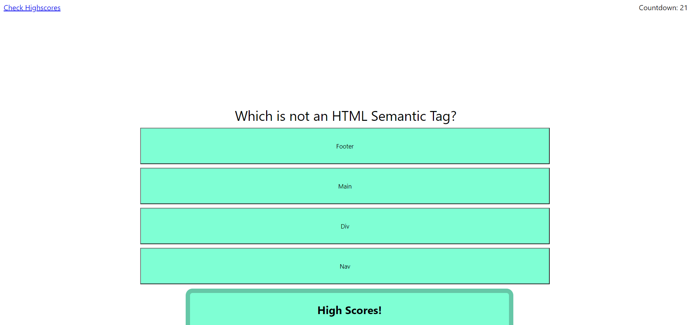

# Coding Quiz

## Site Picture

## Deployed Site
[Site](https://markosanchez800.github.io/coding-quiz/)

## Technology Used
- HTML - Used to create basic structure and flow of the site
- CSS - Used to give the page an individual aesthetic style and design different aspects of the quiz
- JavaScript - Used to give the site all of its actual functionality (User input with a created form, localStorage, and eventListeners for         specific actions)
- Github - Used as the repository for site
- Gitbash - Used to commit and push code to Github as to track changes/progress

## Summary
This project was designed to test the users coding knowledge with a small quiz. Using a set of functions and buttons with event listeners the quiz accurately checks for right and wrong answers as the user progress through the questions.  Once all questions have been answered or the timer runs to zero, the user is presented with their score (time finished) and a form to record that score with their name. 

## Code Snippet
    function startQuiz(){
    startMessage.style.visibility="hidden";
    qNA.style.visibility="visible";
    startTimer();
    first();
    }

    function first(){
    ans1.addEventListener("click",firstWrong);
    ans2.addEventListener("click",firstWrong);
    ans3.addEventListener("click",firstRight);
    ans4.addEventListener("click",firstWrong);
        question.textContent=qAll[0]; 
        ans1.textContent=answerA[0];
        ans2.textContent=answerB[0];
        ans3.textContent=answerC[0];
        ans4.textContent=answerD[0];
    }

### Author Links
- [LinkedIn](https://www.linkedin.com/in/marko-sanchez-800)
- [GitHub](https://github.com/markosanchez800)